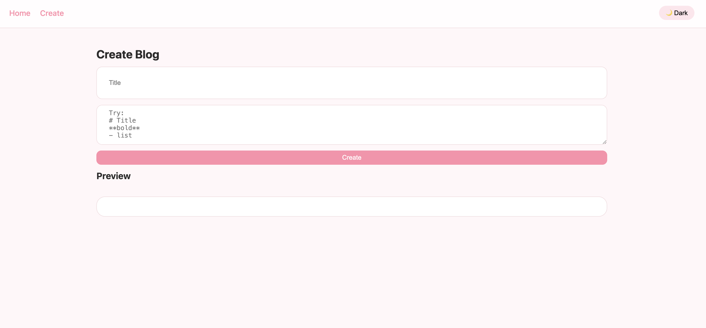
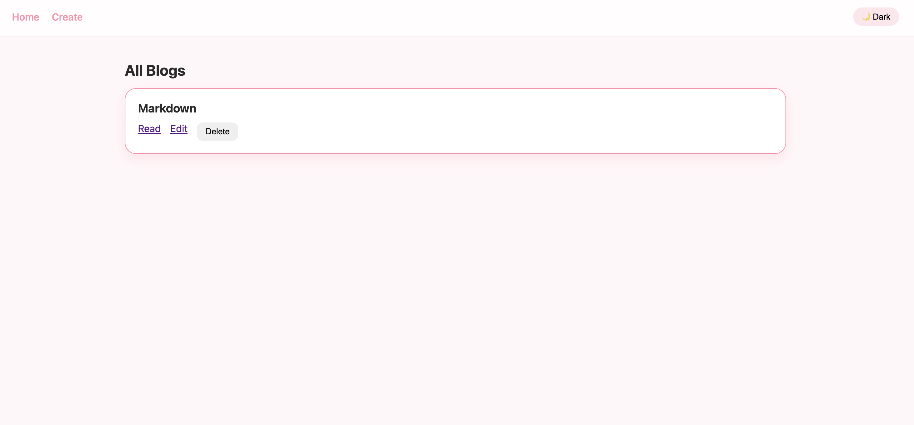
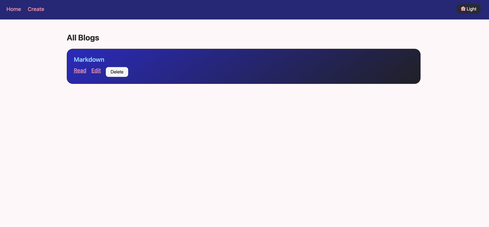
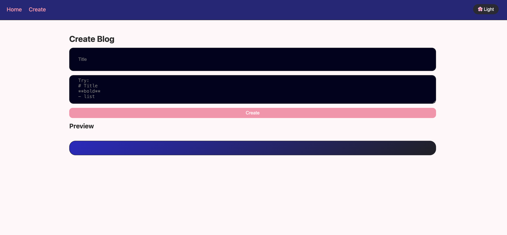

# 📝 Blog App (Project 8)

A modern React Blog Application built with Vite that allows users to create, edit, and manage blogs with a clean UI and dark/light theme support.

---

## 🚀 Features

- Create, edit, and delete blog posts  
- View detailed blog pages  
- Dark / Light mode toggle  
- Data persistence using LocalStorage  
- Context API for state management  
- Markdown-style content rendering  
- Clean pastel UI design  

---

## 🛠️ Tech Stack

- React (Vite)
- React Router
- Context API
- CSS (Custom Styling)
- LocalStorage

---

## 📸 Screenshots

### 🏠 Home Page

### ✍️ Create Blog

### 📖 Blog Detail

### 🌙 Dark Mode

---

## ⚙️ Installation & Setup

Clone the repository:

git clone <your-repo-link>
cd frontendproject8

Install dependencies:

npm install

Run the development server:

npm run dev

---

## 📁 Project Structure

src/
 ├── context/        # Theme & Blog state
 ├── pages/          # Home, Create, Edit, Detail
 ├── assets/         # Images
 ├── App.jsx
 └── main.jsx

---

## 🌟 Key Highlights

- Built using React best practices  
- Clean and reusable components  
- Smooth UI with theme switching  
- Beginner-friendly and scalable  

---

## 📌 Future Improvements

- Add authentication  
- Connect backend (API + database)  
- Rich Markdown editor  
- Like & Comment system  

---

## 👩‍💻 Author

Ritika Jain

---

## ⭐ If you like this project

Give it a star on GitHub!